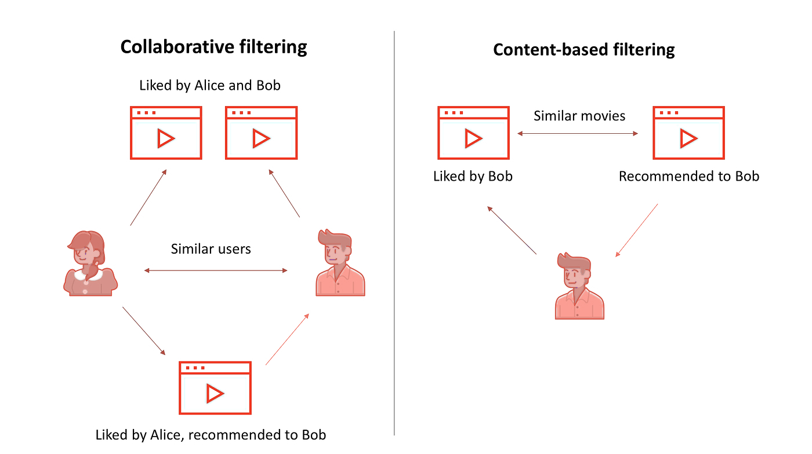
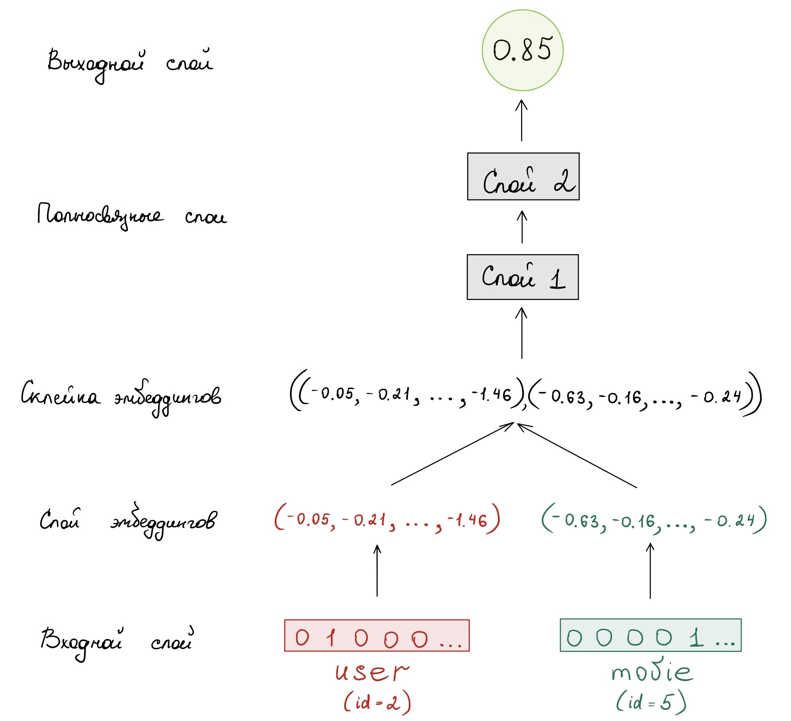
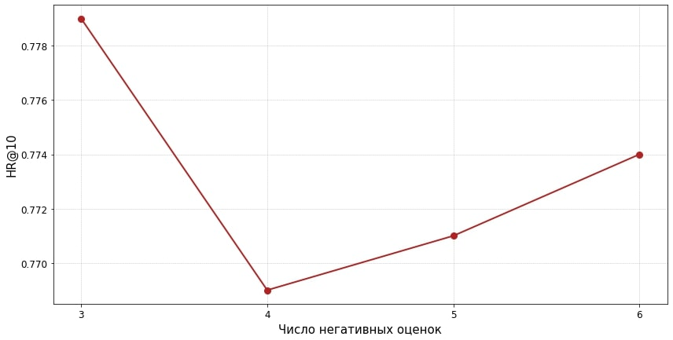
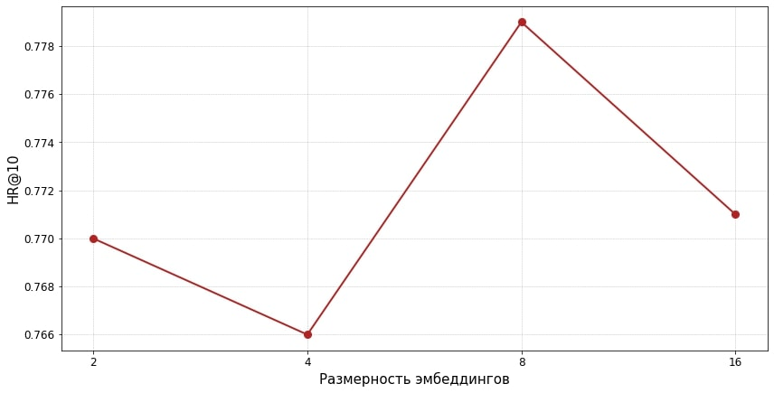
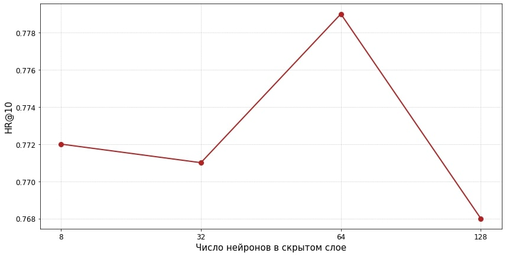

# Рекомендательная система на основе векторных представлений пользователей и фильмов с использованием нейросетевых подходов

Ноутбук проекта:  `сollaborative_filtering.ipynb` 

Рекомендательная система, созданная на основе метода collaborative filtering, использует информацию о предпочтениях пользователей, чтобы делать персонализированные рекомендации. 

Для создания рекомендательной системы на основе collaborative filtering я взяла данные из полного датасета MovieLens (информацию об оценках фильмов, которые были оставлены пользователями в файле ratings.csv). Чтобы сократить объем данных, я взяла только 7000 случайных уникальных пользователей.

Для каждого пользователя я разделила его оценки на обучающую и валидационную выборки. В валидационную выборку я брала только самую последнюю оценку каждого пользователя, а все остальные оценки использовала в обучающей выборке. Это позволило избежать заглядывания в будущее и сохранить порядок оценок пользователя, который может отражать изменение его интересов со временем.

Для предсказания будущих просмотров пользователя я преобразовала оценки в бинарные значения: 1 - если пользователь взаимодействовал с фильмом, и 0 - если не взаимодействовал. Однако, если использовать такую разметку, то получится сильно разреженная матрица, почти все вхождения которой - нули, поэтому я для каждой "1" случайным образом выбираю 3 негативные оценки.

## Описание модели

Архитектура модели для рекомендательной системы основана на использовании эмбеддингов пользователей и фильмов. Для этого я использую отдельный слой эмбеддингов для пользователей и для фильмов, чтобы представить их в низкоразмерном пространстве.
Далее эти эмбеддинги объединяются и передаются через два полносвязных слоя, преобразуясь в вектор предсказания. На выходе используется сигмоидная функция для предсказания наиболее вероятного класса (1 или 0).
 

## Метрика

Для измерения того, насколько хорошо работает рекомендательная система, я выбрала метрику Hit Ratio @ 10 (HR@10).  Это метрика, которая измеряет, как часто в топ-10 рекомендованных объектов присутствует тот, который пользователь уже выбрал или просмотрел. Другими словами, HR@10 оценивает долю случаев, когда рекомендованный объект является интересным для пользователя и попадает в первые 10 рекомендаций. 

Для каждого пользователя я выбираю 99 фильмов, с которыми он не взаимодействовал
$⇒$ добавляю к ним валидационный фильм 
$⇒$ запускаю модель на этих 100 фильмах 
$⇒$ ранжирую фильмы (в соответствии с их предсказанными вероятностями) $⇒$ беру 10 лучших элементов из списка из 100 элементов $⇒$ если валидационный фильм присутствует в топ-10 -- это hit $⇒$ повторяю для всех пользователей 

## Подбор параметров

На рисунках ниже представлены результаты экспериментов по определению оптимальных параметров для модели рекомендательной системы, использующей метрику HR@10. В экспериментах я изменяла три параметра: количество генерируемых негативных оценок, размерность эмбеддингов и число нейронов в первом скрытом слое (при неизменных остальных параметрах).

Исходя из результатов экспериментов, я выбрала оптимальные параметры для модели рекомендательной системы: генерируем 3 негативные оценки,  размерность эмбеддингов = 8, число нейронов в скрытом слое = 64.

В результате оптимизации параметров рекомендательной системы было достигнуто значение метрики HR@10 равное 0.78, что означает, что примерно в 78% случаев пользователю был рекомендован фильм, с которым он действительно взаимодействовал. 

## Модификации

- Я попробовала улучшить классификацию в рекомендательной системе, используя бустинг на деревьях. Для этого я выводила предпоследний слой предобученной модели в бустинг. Однако такое изменение не привело к улучшению метрики. 

- Кроме того, я также попыталась разработать content based рекомендательную систему для фильмов. По imdbId я получила информацию об актерах, режиссерах и описаниях фильмов с сайта IMDb. Затем я пыталась создать эмбеддинги на основе описания фильмов с помощью TF-IDF и SBERT, а также использовала CountVectorizer для рекомендаций по актерам, режиссеру, тегам и жанрам. Однако не успела довести исследование до конца, чтобы построить и протестировать рекомендательную систему. Я планирую продолжить работу в этом направлении и использовать полученные эмбеддинги для рекомендаций фильмов на основе их сходства.

## Всякое

В папке `всякое` можно найти следующие файлы :

- `всякое/info.ipynb` -  по imdbId достаём информацию об актерах, режиссерах и описание фильмов с сайта IMDb

- `всякое/info.csv` - файл, в котором записана вся интересующая информация о фильмах

- `всякое/content_based.ipynb` - немного попыток content-based рекоммендаций

- `всякое/boosting.ipynb` - пробую добавить бустинг в модель

